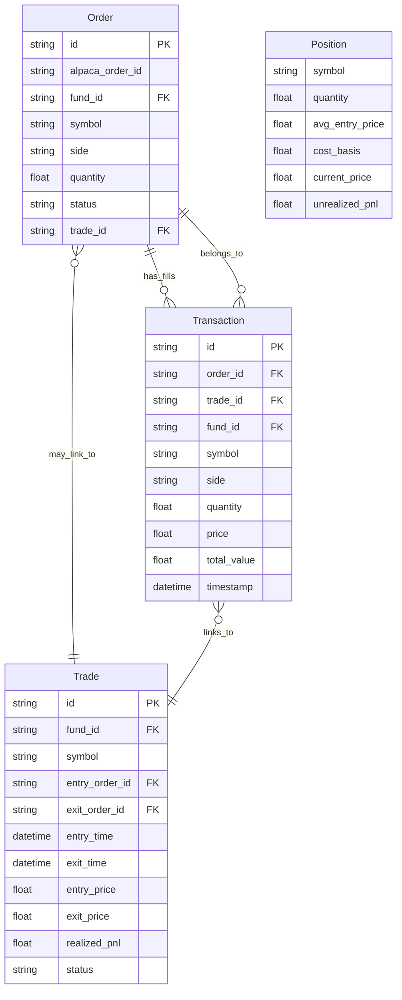
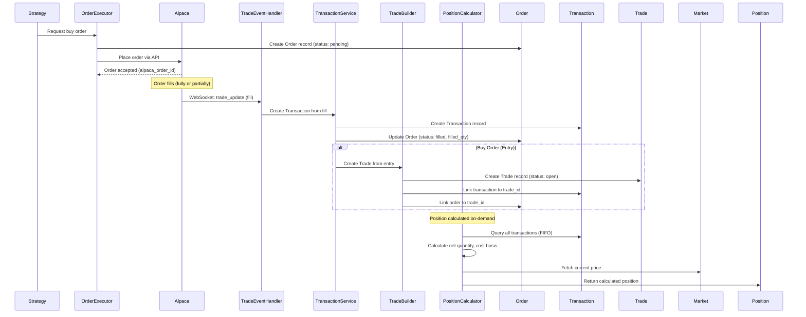
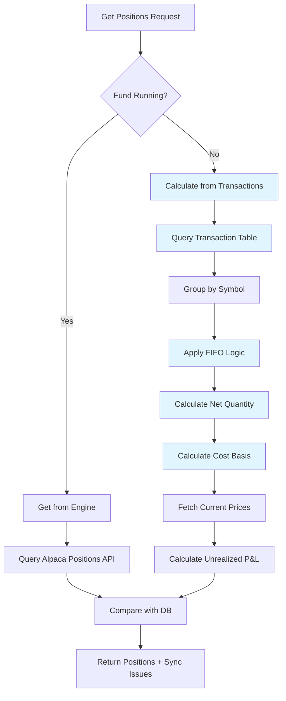
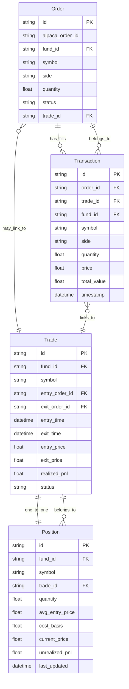
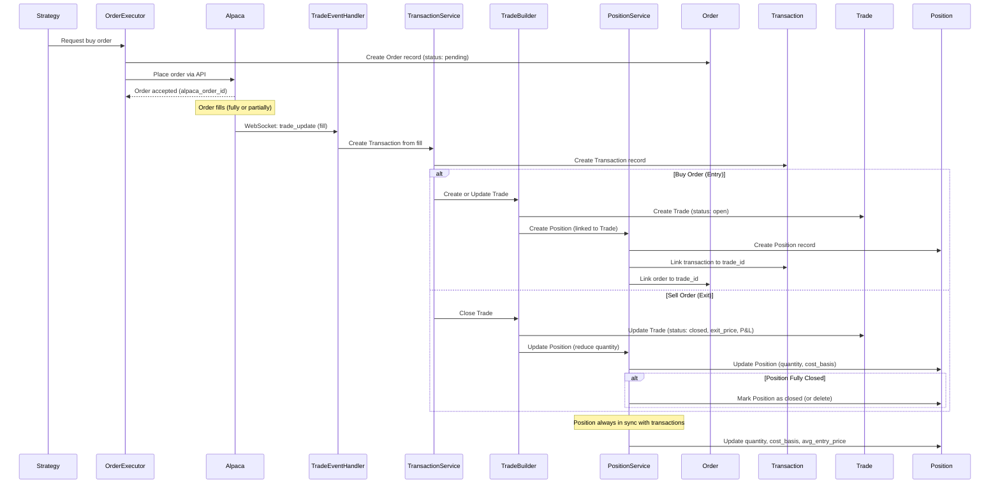
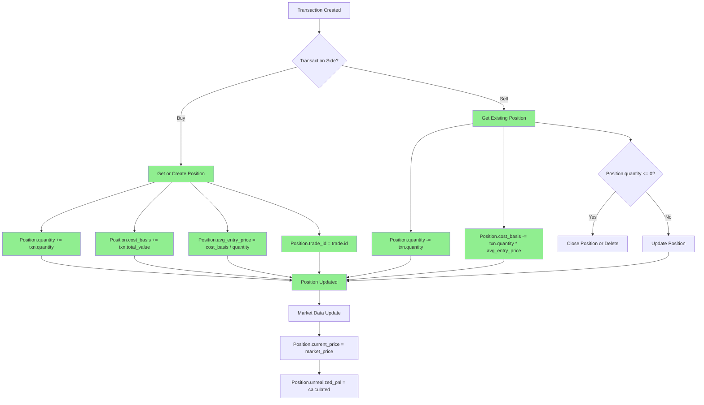
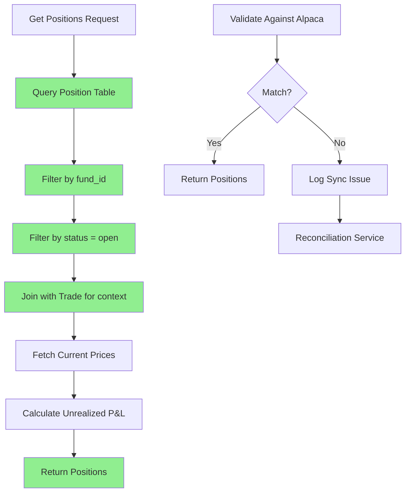

# Order, Transaction, Trade, and Position Architecture

This document describes the current state and ideal state for how Orders, Transactions, Trades, and Positions interact in the Printer trading system.

## Entity Definitions

### Order

- **Purpose**: Request to buy/sell (placed with Alpaca)
- **Status**: `pending`, `filled`, `canceled`, `failed`, etc.
- **Can be**: Partially filled (multiple fills = multiple transactions)
- **Links to**: `alpaca_order_id`, `trade_id` (optional)

### Transaction

- **Purpose**: Actual execution/fill of an order (the ledger)
- **Created**: When an order is filled (fully or partially)
- **Contains**: `symbol`, `side` (buy/sell), `quantity`, `price`, `total_value`, `timestamp`
- **Links to**: `order_id`, `trade_id`, `alpaca_fill_id`
- **One order can produce**: Multiple transactions (if partially filled)

### Trade

- **Purpose**: Complete lifecycle from entry to exit
- **Aggregates**: Multiple transactions (entry + exit)
- **Tracks**: Performance metrics (P&L, hold duration, MAE/MFE)
- **Links to**: `entry_order_id`, `exit_order_id`, entry/exit transactions via `trade_id`

### Position

- **Purpose**: Current holdings (calculated, not stored)
- **Source of Truth**: Calculated from Transaction ledger (FIFO)
- **Contains**: `symbol`, `quantity`, `avg_entry_price`, `cost_basis`, `current_price`, `unrealized_pnl`
- **Validated Against**: Alpaca positions API

---

## Current State

### Entity Relationship Diagram



### Current Flow: Order → Transaction → Trade → Position



### Current Position Calculation



### Current Issues

1. **Position is Calculated, Not Stored**

   - Must query all transactions every time
   - FIFO calculation is expensive for large histories
   - No caching mechanism

2. **Trade Creation Timing**

   - Trade created on first buy transaction
   - But trade_id may not be set on order immediately
   - Can lead to orphaned transactions

3. **Position Sync Complexity**

   - Must compare calculated positions with Alpaca
   - Complex logic to handle multi-fund scenarios
   - Sync issues require manual reconciliation

4. **No Direct Position → Trade Link**
   - Positions calculated independently
   - Must query trades separately to see which trades are open
   - No clear mapping: "This position = This trade"

---

## Ideal State

### Entity Relationship Diagram (Ideal)



### Ideal Flow: Order → Transaction → Trade → Position



### Ideal Position Management



### Ideal Position Query Flow



### Key Improvements in Ideal State

1. **Position as Stored Entity**

   - Position table stores current state
   - Updated incrementally on each transaction
   - No need to recalculate from full transaction history
   - Fast queries: `SELECT * FROM positions WHERE fund_id = ? AND status = 'open'`

2. **1:1 Trade ↔ Position Relationship**

   - Each open Trade has exactly one Position
   - Each Position belongs to exactly one Trade
   - Clear mapping: "This position = This trade"
   - When trade closes, position closes (or deletes)

3. **Incremental Updates**

   - Position updated on transaction creation
   - No need to recalculate from scratch
   - Atomic updates ensure consistency

4. **Simplified Sync**

   - Position table is source of truth for DB
   - Compare with Alpaca positions
   - Reconciliation service can update positions directly

5. **Better Query Performance**
   - Direct table queries instead of transaction aggregation
   - Can index on `fund_id`, `symbol`, `status`
   - Supports efficient filtering and sorting

---

## Migration Path

### Phase 1: Add Position Table

```sql
CREATE TABLE positions (
    id VARCHAR(36) PRIMARY KEY,
    fund_id VARCHAR(36) NOT NULL,
    symbol VARCHAR(10) NOT NULL,
    trade_id VARCHAR(36) UNIQUE,  -- 1:1 with open Trade
    quantity FLOAT NOT NULL,
    avg_entry_price FLOAT NOT NULL,
    cost_basis FLOAT NOT NULL,
    current_price FLOAT,
    unrealized_pnl FLOAT,
    unrealized_pnl_percent FLOAT,
    status VARCHAR(20) DEFAULT 'open',  -- open, closed
    last_updated TIMESTAMP WITH TIME ZONE,
    created_at TIMESTAMP WITH TIME ZONE,
    FOREIGN KEY (fund_id) REFERENCES funds(id),
    FOREIGN KEY (trade_id) REFERENCES trades(id)
);

CREATE INDEX idx_positions_fund_status ON positions(fund_id, status);
CREATE INDEX idx_positions_symbol ON positions(symbol);
CREATE INDEX idx_positions_trade_id ON positions(trade_id);
```

### Phase 2: Backfill Positions

- Calculate current positions from transaction history
- Create Position records for all open positions
- Link to existing open Trades

### Phase 3: Update Transaction Handlers

- Modify `TransactionService` to update Position on create
- Modify `TradeBuilder` to create/update Position
- Ensure atomic updates (transaction + position in same DB transaction)

### Phase 4: Update Position Queries

- Replace transaction aggregation with Position table queries
- Keep Alpaca sync validation
- Update reconciliation service to use Position table

### Phase 5: Deprecate Old Calculation

- Remove transaction-based position calculation
- Keep as fallback for validation/reconciliation

---

## Benefits Summary

### Current State

- ✅ Simple: Positions calculated from transactions
- ❌ Slow: Must query all transactions
- ❌ Complex: FIFO calculation on every request
- ❌ No direct Trade ↔ Position link

### Ideal State

- ✅ Fast: Direct table queries
- ✅ Simple: Incremental updates
- ✅ Clear: 1:1 Trade ↔ Position relationship
- ✅ Efficient: Indexed queries
- ✅ Consistent: Atomic updates

---

## Notes

- **Position is a derived entity**: It's calculated from transactions, but storing it makes queries much faster
- **Trade is the business entity**: Represents a complete trade lifecycle
- **Transaction is the ledger**: Immutable record of all fills
- **Order is the request**: What we asked Alpaca to do
- **Position is the current state**: What we currently hold (derived but stored for performance)
